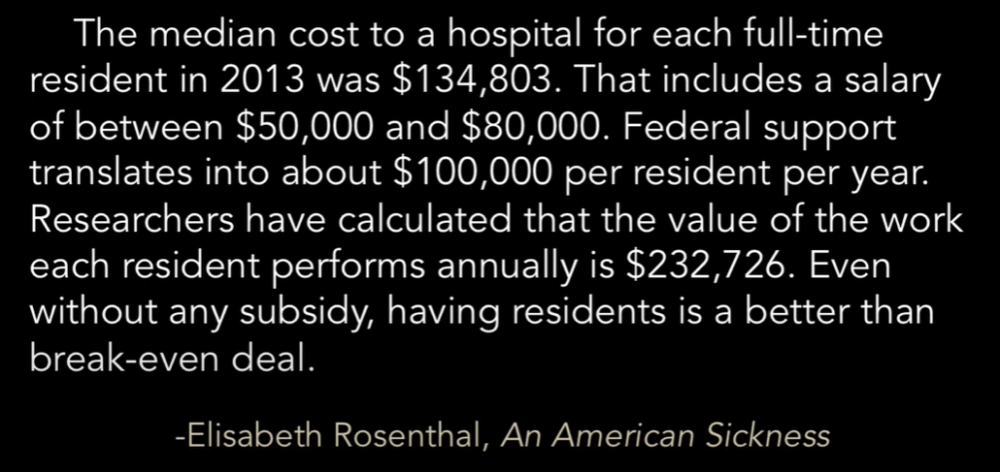

## Future of Healthcare 

> It has always been about adding shareholder value. 

The best arbitrage in healthcare is usage of interns/residents/medical students. 

> $323,727 - $80,000 = $243,727

https://pubmed.ncbi.nlm.nih.gov/32916653/
https://pubmed.ncbi.nlm.nih.gov/11251744/

I predict (2/5/2025) that AI will replace doctors. Perhaps in my lifetime, perhaps not. 