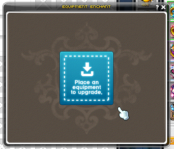
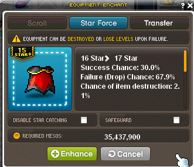
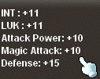
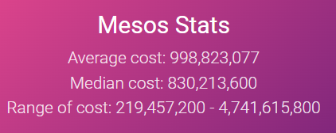
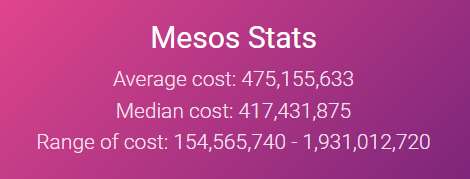

# Star Forcing Guide
---
If you're new to star forcing, hopefully this guide will help you get massive gains and increase combat power to fight stronger bosses.

The past weekend was shiny starforce. This means that there's 30% off starforcing and 5/10/15 are guaranteed. I attended this event, but ended up having the same combat power for spending 5 billion mesos. 

Here is a guide to get more out of your mesos.

#### What is Star Forcing?

It's how you can upgrade your equipment.

Press enhance on your keyboard and you'll get a pop-up that looks like this

You then place a piece of equipment in it. 

Here you can see that the success rate to get 17 stars is 30%, chance of dropping to 15 stars is 67% and destruction (it's drops to 13 stars) is 2.1%

If I succeed, I would get these stats

This magic attack would be a huge increase in my combat power, but my chance of succeeding is only 1 in 3 (on average). 

That means that the cost is actually more than 35 million mesos. 

So, in this guide, my goal is to show you 
1. how much money you need
2. how many extra pieces you need
3. great pieces of fodder or equipment you can 

#### How much money do I need to go from 0 stars to x stars?

Check out a calculator created by someone else [here](https://brendonmay.github.io/starforceCalculator/)! 

When you're first starting out, trying to kill bosses like lomien with combat power 0.5-3 million, your goal is to 17 star all your equipment. 

> Why 17 stars?
> Because it's way more expensive trying to go higher (0 &rarr; 17 costs the same as 17 &rarr; 18)

With no event, you're going to need 1 billion mesos going from 0 &rarr; 17 stars. 

On shiny day, it costs roughly half

Assuming it's level 150 gear, no starcatching and no safeguarding (Absolab).

Example: Let's say I have Absolab weapon, cape, and glove, and CRA hat, top, bottom, and Pink Bean eye. 

In total that's 7 items that can go from 0 &rarr; 17.  

If we say each item is around half a billion to get 17 stars, then we need 3.5 billion mesos for the event. 

> If you know how much you need for the event, you will be prepared for gains.

Or else, your items will actually lose more stars (more stats).

#### How many extras pieces do I need in case of boom?

You can use the calculator again, but I would say prep more than you think and use fodder more than you think. 

#### Fodder

Save Hard Ranmaru drops.

They are level 150 and Absolab is level 160. 

This means you can transfer immediately from one to the next.

Transfer Pink Bean belt to Superior Gollux belt.

Go Dea Sidus Earrings to Reinforced gollux to Superior

## TL;DR

1. shiny: save .5 bil mesos per item per 17 stars
2. think you're going to boom a lot
3. save ranmaru equips for absolab and pink bean belt for gollux

# GOOD LUCK